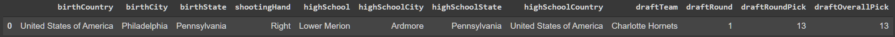
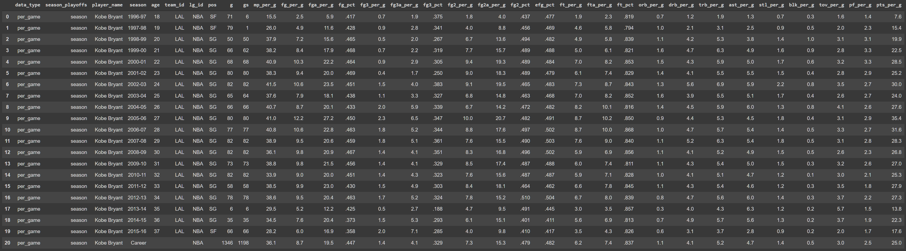
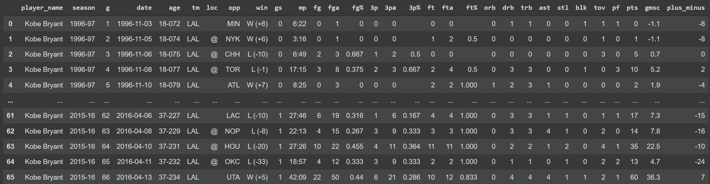

# NBA-Prediction-Algorithms

This is an **unofficial** Python-based parser of [www.basketball-reference.com](www.basketball-reference.com) allowing NBA and statistics enthusiasts to observe and analyze NBA data.


# Goals

The goal of this repository is to provide easy-to-execute methods to access NBA player and team data. 

Using this repo, our hope is that everyday fans like us can perform statistical analyses to potentially build models that can: 

1. Regress team wins by player biodata (i.e. win percentage vs. height/age/etc)
2. Generate comprehensive statistics to determine the GOAT (greatest of all time) and GOED (greatest of each decade)
3. Assess anomalies in betting lines

and much more.

# Getting Started

The two easiest ways to utilize this code is either by using it in the Google Colab environment, or setting up your own virtualenv.

### Google Colab

The following notebooks have been provided if you prefer to use Google Colab:

* [single_player_search.ipynb](https://github.com/rahim-hashim/NBA-Prediction-Algorithms/blob/df_version/single_player_search.ipynb): scrape biodata and basic (per game, total) and advanced (per-minute, per-possession, per-play, shooting, salary) season-wide statistics for single players, as well as gamelogs for that player
  * *Example:* all major [Kobe Bryant Data Tables](https://www.basketball-reference.com/players/b/bryanko01.html) (including season and playoffs) and [gamelogs](https://www.basketball-reference.com/players/b/bryanko01/gamelog/2011)
* [basketball-reference-scraper.ipynb](https://github.com/rahim-hashim/NBA-Prediction-Algorithms/blob/df_version/basketball-reference-scraper.ipynb): scrape the same data as [single_player_search.ipynb](https://github.com/rahim-hashim/NBA-Prediction-Algorithms/blob/df_version/single_player_search.ipynb) but for all players in the entire database
  * *Note:* given the tens of thousands of html requests, this takes many hours to complete, but the data can be saved so that you only have to run this once

### Virtualenv

Follow the [Hitchhiker's guide to python](https://docs.python-guide.org/dev/virtualenvs/) to set up a virtual environment. Most of the packages used come native to python3, but you may need to install these using the following commands

**BeautifulSoup:** `pip3 install bs4`

* [BeautifulSoup documentation](https://www.crummy.com/software/BeautifulSoup/bs4/doc/)

**tqdm:** `pip3 install tqdm`

* [tqdm documentation](https://github.com/tqdm/tqdm)

# Scraping

### Single Player Function Calls

`kb_meta, kb_data, kb_gamelogs = single_player_scraper('Kobe Bryant')`

##### **Pandas DataFrames**

`kb_meta`



`kb_data`



`kb_gamelogs`



### Entire Database Scraping Calls

Only needs to be completed once.

```python
ROOT = <set/path/to/repo>
df_players_meta, df_players_data, df_players_gamelogs = main(ROOT)
```

After scraping, you can access the data by unpickling the DataFrames

```python
players_df_meta = pickle_load(DATA_PATH+'players_df_meta.pkl')

players_df_data = pickle_load(DATA_PATH+'players_df_data.pkl')

players_df_gamelogs = pickle_load(DATA_PATH+'players_df_gamelogs.pkl')
```

# Example Analyses

### Biodata — Filter for Largest Recorded Players

```python
# Player Meta Query
df_large = df_players_meta.loc[(df_players_meta['height']>80) & 
                   (df_players_meta['weight']>30)]

df_large = df_large.dropna(how='all', axis='columns') # drops all columns that are empty
display(df_large[df_large['weight'] == df_large['weight'].max()])
```

### Season Data — Find Specific Game Stat Maxes

Select any of the following data types for different table fields: 

* Per Game (per_game)
* Totals (totals)
* Advanced
* Per Minute
* Per Possession
* Adjusted Shooting
* Play-By-Play
* Shooting
* All-Star
* Salaries

The following is a an example to filter for *Per Game* statistics:

```python
table_selected = players_df_data[players_df_data['data_type'] == 'per_game']

table_selected[table_selected['pts_per_g'] == np.nanmax(table_selected['pts_per_g'])]
```

### Gamelogs — Find Specific Game Stat Maxes

```python
players_df_gamelogs[players_df_gamelogs['pts']==np.nanmax(players_df_gamelogs['pts'])]
```

# Acknowledgements

This project was built entirely by Rahim Hashim (<rahimh233@gmail.com>) and Aunoy Poddar (<aunoyp@gmail.com>). None of this could have been done without the tireless and comprehensive effort of those who work at [Basketball Reference](http://www.basketball-reference.com/) providing an open-source, API-friendly database containing millions of datapoints from which the entirety of this codebase is built.
